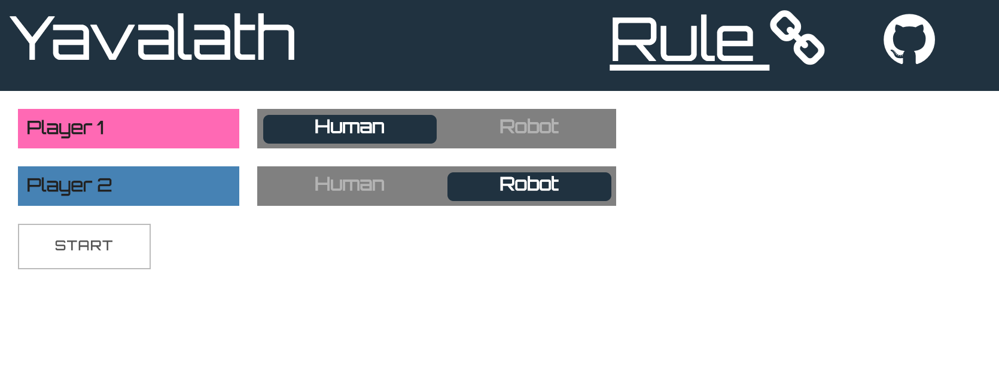
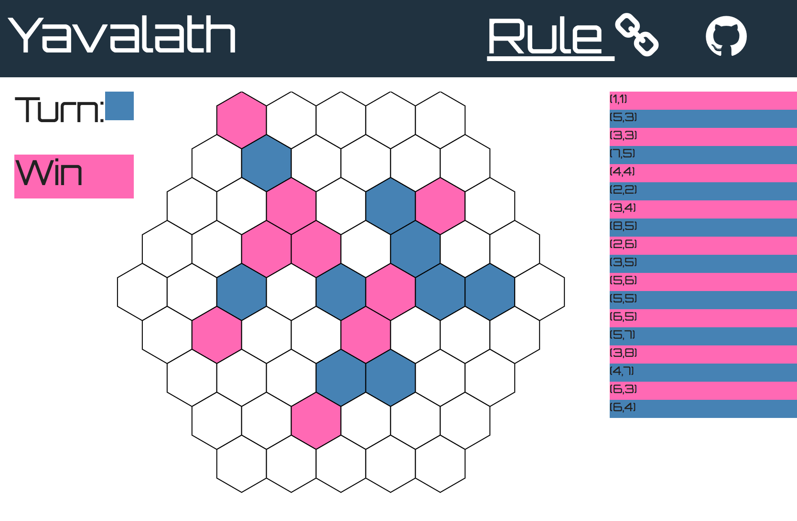

# yavalath-baobab [](https://travis-ci.org/airtoxin/yavalath-baobab)

yavalath is abstract strategy boardgame generated by computer





## Start

__requiring environment variables about firebase__

+ apiKey
+ authDomain
+ databaseURL
+ messagingSenderId
+ storageBucket

```sh
yarn
npm i webpack-dev-server
npm run dev
```

## License

MIT
